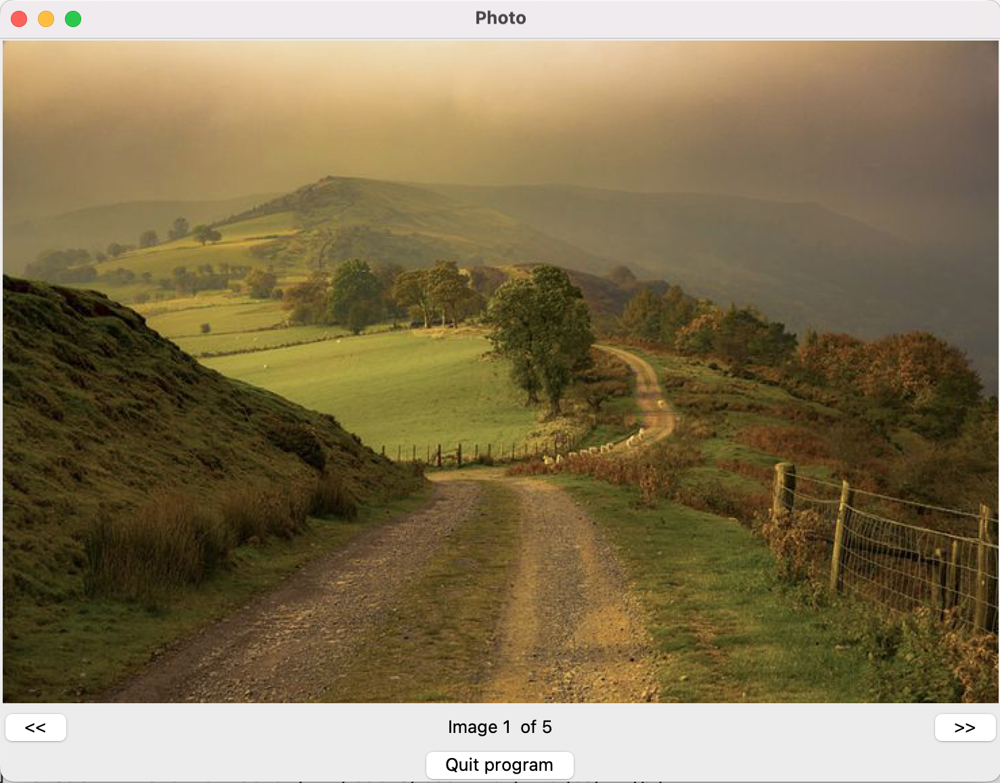

# Tkinter Photo Viewer

This project is a simple **image viewer application** built using Python’s `tkinter` GUI toolkit and the `Pillow` library (`PIL`).  
It allows users to browse through a collection of images with forward and backward navigation buttons.



## Features
- Displays multiple images in sequence.  
- Allows navigation between images using “<<” (back) and “>>” (forward) buttons.  
- Shows the current image number and total image count in a status bar.  
- Includes a “Quit program” button to close the application.  
- Automatically loops from the last image to the first and vice versa.


## Requirements
Make sure the following are installed:

- Python 3.x  
- `tkinter` (usually included with Python)
- `Pillow` (Python Imaging Library fork)

Install Pillow with:
```bash
pip install pillow
```


## Folder Structure
```
project-folder/
│
├── image_viewer.py        # main Python file
└── images/
    ├── 1.jpg
    ├── 2.jpg
    ├── 3.jpg
    ├── 4.jpg
    └── 5.jpg
```

Make sure the **`images/`** folder is in the same directory as your Python file and contains the image files named `1.jpg` to `5.jpg`.


## How to Run
1. Save the Python script (e.g., `photo_viewer.py`).  
2. Open a terminal or command prompt in the same folder.  
3. Run the program:
   ```bash
   python photo_viewer.py
   ```

The application window will open, showing the first image. Use the **<<** and **>>** buttons to navigate.


## Notes
- You can add more images by updating the `img_list` with additional image paths.
- To use other image formats (e.g., PNG, GIF), Pillow supports most standard formats.
- Make sure the image files exist and paths are correct to avoid `FileNotFoundError`.


**License:** MIT
````
